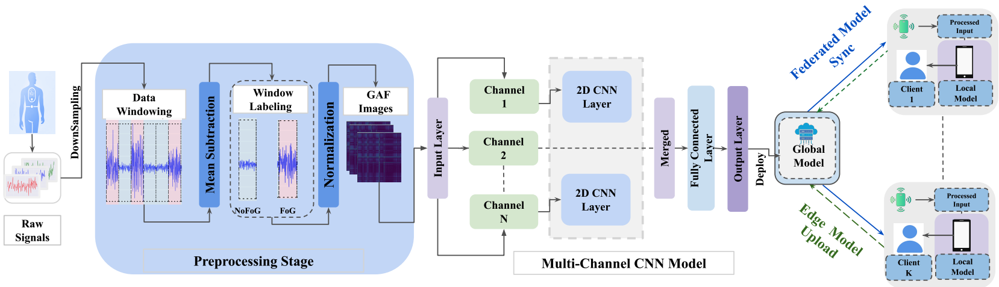
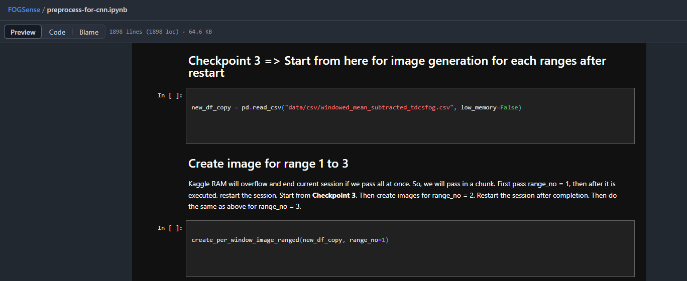

# *Freezing of Gait Detection Using Gramian Angular Fields and Federated Learning from Wearable Sensors*

***Shovito Barua Soumma, S M Raihanul Alam, Rudmila Rahman, Umme Niraj Mahi, Abdullah Mamun, Sayyed Mostafa Mostafavi, Hassan Ghasemzadeh***
---

##### *FOGSense has been accepted at The 47th Annual International Conference of the IEEE Engineering in Medicine and Biology Society (EMBC), July 14–17, 2025, Copenhagen, Denmark*
*

#### Full-text PDF: [https://arxiv.org/abs/2411.11764](https://arxiv.org/abs/2411.11764)


## How to cite?
````
@misc{fogsense2025,
      title={Freezing of Gait Detection Using Gramian Angular Fields and Federated Learning from Wearable Sensors}, 
      author={Shovito Barua Soumma and S M Raihanul Alam and Rudmila Rahman and Umme Niraj Mahi and Abdullah Mamun and Sayyed Mostafa Mostafavi and Hassan Ghasemzadeh},
      year={2024},
      eprint={2411.11764},
      archivePrefix={arXiv},
      primaryClass={cs.LG},
      url={https://arxiv.org/abs/2411.11764}, 
}
````

## Table of Contents
- [To Cite This Work](#how-to-cite)
- [Abstract](#abstract)
- [Dataset](#dataset)
- [Project Structure](#project-structure)
- [Getting the Code](#getting-the-code)
- [Running the Code](#running-the-code)
  - [Requirements](#requirements)
  - [Setup Environment](#setup-environment)


## Abstract
Freezing of gait (FOG) is a debilitating symptom of Parkinson's disease (PD) that impairs mobility and safety. Traditional detection methods face challenges due to intra and inter-patient variability, and most systems are tested in controlled settings, limiting their real-world applicability. Addressing these gaps, we present ***FOGSense***, a novel FOG detection system designed for uncontrolled, free-living conditions. It uses Gramian Angular Field (GAF) transformations and federated deep learning to capture temporal and spatial gait patterns missed by traditional methods. We evaluated our FOGSense system using a public PD dataset, 'tdcsfog'. FOGSense improves accuracy by 10.4% over a single-axis accelerometer, reduces failure points compared to multi-sensor systems, and demonstrates robustness to missing values. The federated architecture allows personalized model adaptation and efficient smartphone synchronization during off-peak hours, making it effective for long-term monitoring as symptoms evolve. Overall, FOGSense achieves a 22.2% improvement in F1-score compared to state-of-the-art methods, along with enhanced sensitivity for FOG episode detection.


## Dataset
- **Orginial dataset:** [https://www.kaggle.com/competitions/tlvmc-parkinsons-freezing-gait-prediction/data](https://www.kaggle.com/competitions/tlvmc-parkinsons-freezing-gait-prediction/data)

- **To create GAF Images:** use [preprocess-for-cnn.ipynb](preprocess-for-cnn.ipynb) and excecutes cells after titled ***Checkpoint 3 => Start from here for image generation for each ranges after restart*** 

- Download the our preprocessed gaf images: [https://drive.google.com/drive/folders/1-4T7mhb15FF-LjHrpjDIB_PSonsBBbIW](https://drive.google.com/drive/folders/1-4T7mhb15FF-LjHrpjDIB_PSonsBBbIW)


## Project Structure

```    
parkinsons-fog-detection/
├── data/
│   ├── csv/                      # Raw and processed CSV files
│   ├── mean_subtract/            # Processed data directory
│   │   └── gaf_images/          # GAF images for CNN input
│   │       ├── AccV/            # Vertical acceleration
│   │       ├── AccML/           # Medio-lateral acceleration
│   │       └── AccAP/           # Anterior-posterior acceleration
│   └── federated_learning_data/  # Data split for federated learning
├── models/
│   └── cnn_models.py            # CNN architecture definitions
└── notebooks/
    ├── preprocess-for-cnn.ipynb              # Data preprocessing
    ├── image_training_with_multi_channel_cnn.ipynb              # Non-Federated image training
    ├── federated_learning_weighted_avg.ipynb
    └── federated_learning_with_resource_monitor.ipynb
```

## Features

### Core Functionality
- Multi-channel CNN for FOG detection
- Federated learning with weighted averaging
- GAF transformation of accelerometer data

### Resource Monitoring
- Real-time tracking of:
  - CPU utilization
  - Memory usage
  - GPU utilization and memory
  - Training metrics
- Visual monitoring through:
  - Live resource usage plots
  - Training metrics visualization
  - Per-class performance tracking

## Usage

### Resource Monitoring Setup
```python
monitor = ResourceMonitor(interval=1.0)
monitor_callback = ResourceMonitorCallback(monitor)

# Add to training callbacks
callbacks = [
    monitor_callback,
    MetricsDisplayCallback(num_classes=2)
]
```

### Federated Training with Monitoring
```python
server = create_federated_learning_system(
    num_clients=5,
    train_generator=train_generator,
    valid_generator=valid_generator
)

monitor.start()
metrics_history = train_federated(
    server,
    num_rounds=10,
    local_epochs=5,
    callbacks=callbacks
)
```

### Resource Analysis
```python
# View resource usage summary
monitor.plot_resources()
summary = monitor.get_summary()
```

### Resource Utilization Pattern
```
Training Resource Usage:    
                                              
Memory   ┤█████████░░ 75%                     
GPU Mem  ┤████████░░░ 70%                     
CPU      ┤███████░░░░ 65%                     
         └─────────────────────────
              25   50   75   100%
```

## Model Architecture

- Three CNN branches (AccV, AccML, AccAP)
- Each branch:
  - 3 Conv2D layers (32->64->128 filters)
  - Batch normalization
  - MaxPooling and Dropout
- Dense layers: 128->64->2
- Softmax output

## Dataset
- 62 subjects split:
  - Training: 69.4%
  - Testing: 19.4%
  - Validation: 11.3%

-----
## Getting the code

You can download a copy of all the files in this repository by cloning the
[git](https://github.com/shovito66/FOGSense) repository:
  ```
    git clone git@github.com:shovito66/FOGSense.git
  ```
or [download a zip archive](https://github.com/shovito66/FOGSense/archive/master.zip).

# Running the code

-----
## Requirements
We use `conda` virtual environments to manage the project dependencies in
isolation.
Thus, you can install our dependencies without causing conflicts with your
setup (even with different Python versions).

Run the following command in the repository folder (where `main.py`
is located) to create a separate environment and install all required
dependencies in it:
    
    conda env create

[//]: # (## Reproducing the results)
## Setup Environment
Before running any code you must activate the conda environment:
    
    source activate ENVIRONMENT_NAME

or, if you're on Windows:

    activate ENVIRONMENT_NAME
**if you are on Windows/Linux:** To install the necessary dependencies, you can use the provided `requirements.txt` file. Run the following command:

    pip install -r requirements.txt
**if you are on Macos**: Use `requirements-macos.txt` file (inside `/code` directory)  to install the dependencies

    pip install -r requirements-macos.txt

----


# Contact
>For any questions or issues, please contact 
*  ***[Shovito Barua Soumma](https://www.shovitobarua.com)*** at [shovito@asu.edu](shovito@asu.edu)


[](LICENSE)